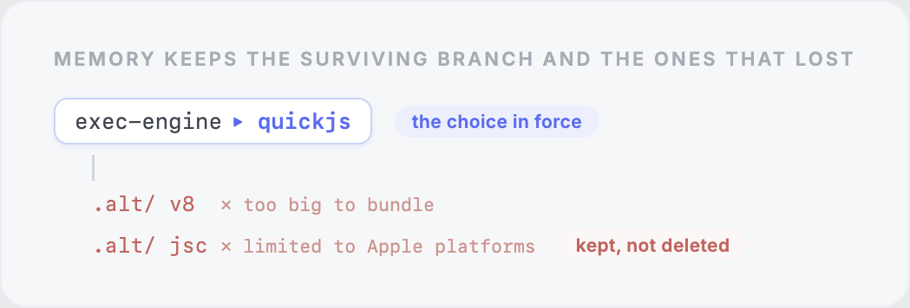
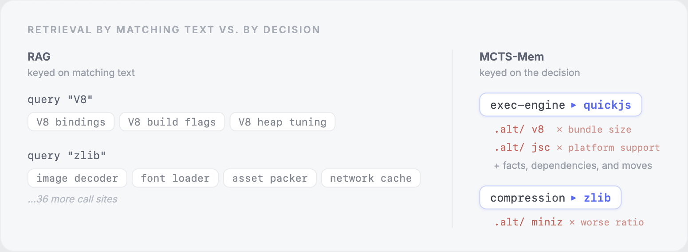
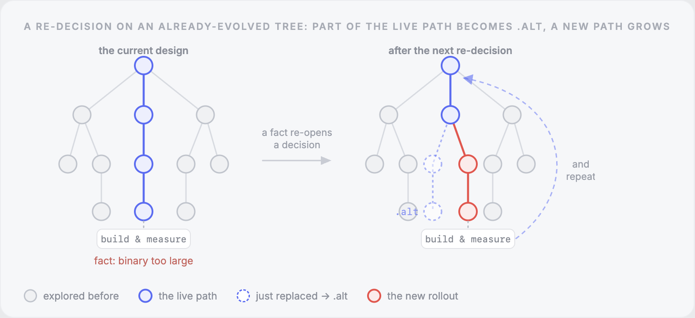
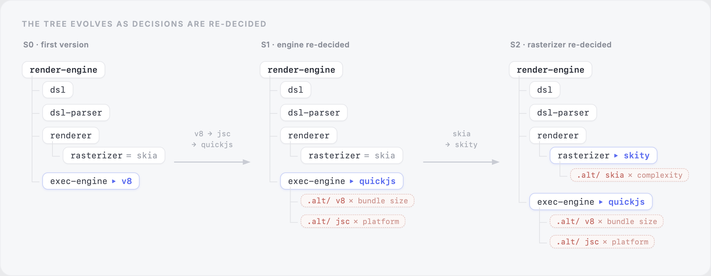
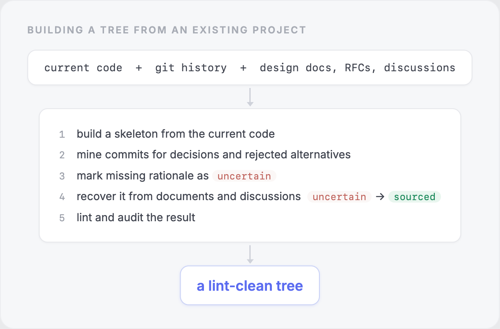
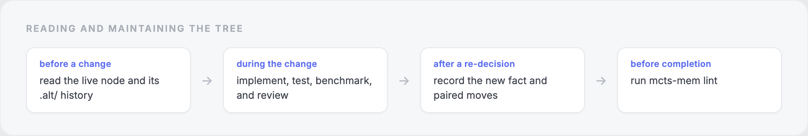

# MCTS-Mem

### A Structured Memory of Why a Codebase Is Built the Way It Is

A codebase tells us how a project works today. Git tells us how the code changed over time.

However, neither reliably tells us why the project ended up with its current design.

Why did the team choose QuickJS instead of V8? Was the previous cache replaced because it was slow, incorrect, or difficult to maintain? Which alternatives were tested? Which constraints still apply?

MCTS-Mem records this information as a structured design tree:

- the decision currently in force;
- the alternatives it replaced;
- the facts that supported the decision;
- and the provenance of each fact.

The tree consists of Markdown files, lives next to the code, and has a linter that checks its internal consistency.

This README explains the motivation behind MCTS-Mem, how the tree works, and how to build and maintain one for an existing project.

## 1. A brief definition of design memory

When working on a software project, we usually see the result of its design history rather than the history itself.

For example, suppose a rendering engine currently uses QuickJS. The code can tell us that QuickJS is the active implementation. It may not tell us that the project previously:

1. used V8;
2. replaced V8 because it added too much binary size;
3. tried JavaScriptCore;
4. replaced JavaScriptCore because the engine also had to run outside Apple platforms.

The missing information is the project’s design memory.



In other words, design memory includes both the branch that survived and the branches that did not.

This distinction matters because a rejected design can remain technically plausible. Without the reason it was rejected, a new engineer or coding agent may propose it again.

## 2. Why project reasoning gets lost

A software project contains two related bodies of knowledge.

The first is the implementation. Git records changes to it, tests exercise it, and compilers check many kinds of inconsistency.

The second is the reasoning behind the implementation. This information is usually distributed across:

- design documents and RFCs;
- issues and pull requests;
- commit messages;
- benchmark notes;
- chat conversations;
- code comments;
- and the memories of the people who made the decisions.

The main problem is that this second body of knowledge has no equivalent of a compiler.

A design document can continue describing an implementation that disappeared two years ago. Two RFCs can disagree without producing an error. A benchmark can be corrected while the decision based on the original result remains unchanged in a wiki.

Nothing fails when the explanation drifts away from the code.

As a result, stale reasoning often looks just as trustworthy as current reasoning.

A related problem is that some reasoning is never written down at all. An architectural rule may survive only as a team convention, a constraint may hold only because one engineer remembers it, and a requirement may live in a chat thread rather than in any enforced form. This unwritten intent behaves like debt: the project depends on it, yet no document records it and no check enforces it.

### 2.1 The limitation of chronological decision logs

Architecture Decision Records, or ADRs, are probably the closest existing format to MCTS-Mem.

An ADR usually records a decision, its context, and its consequences. This works well when the project makes the decision for the first time.

It becomes harder to use after the same part of the system has been reconsidered several times.

Suppose the execution engine changed like this:

```text
V8 → JavaScriptCore → QuickJS
```

The explanation may now be spread across three ADRs written years apart. To understand the current decision, a reader has to:

1. find all three records;
2. reconstruct their order;
3. determine which statements remain valid;
4. identify why each alternative lost.

MCTS-Mem organizes the same information around the decision instead of the date.

V8, JavaScriptCore, and QuickJS all appear at the execution-engine node. Dates still preserve the sequence, but the reader does not have to reconstruct the relationship from a chronological log.

### 2.2 The limitation of similarity-based retrieval

Another approach is to place all project documentation in a retrieval system and ask an LLM to find the relevant passages.

This is useful, but retrieval solves a somewhat different problem.

Most RAG systems retrieve text based on similarity. The passages that look most similar to a query are not necessarily the ones that explain the current decision.

For example, searching for “V8” may retrieve:

- V8 build instructions;
- V8 bindings;
- V8 heap configuration;
- old V8 debugging notes.

All of these passages may be outdated.

The most important fact may instead say:

> QuickJS replaced the previous engine because it reduced the application bundle by 40 MB.

That passage may not rank highly for a query about V8.

The opposite problem occurs with a common dependency such as zlib. Searching for “zlib” may return dozens of call sites while burying the single decision that explains why the project chose it.



RAG can help find the source material. MCTS-Mem gives that material a structure once we know which decision it belongs to.

## 3. A codebase as a design search

The name MCTS-Mem comes from viewing software development as a search over possible designs.

A team selects a problem, tries an approach, implements enough of it to learn something, and then keeps or rejects it. A benchmark, test, failed port, production incident, or review supplies the result.

That result changes what the team tries next.

This resembles the four common steps of Monte Carlo Tree Search:

1. **Select** a decision worth investigating.
2. **Expand** it with a candidate design.
3. **Roll out** the candidate by implementing and evaluating it.
4. **Backpropagate** the result so that future choices start with better information.

Figure 1 shows one turn of this loop on real software. Because the project already exists, the tree is not empty: the current design is a full path from root to a leaf. Measuring that path produces a fact that re-opens a decision partway down, a new branch replaces the rest of the path, and the replaced part is kept as an alternative.



There is an important caveat here.

MCTS-Mem does not run a conventional MCTS algorithm over a repository. The name describes the shape of the design process and the information preserved from it.

In a board game, a program can run millions of inexpensive simulations. In software, one meaningful rollout may require days of implementation, a hardware port, or a benchmark campaign.

This makes software rollouts sparse and expensive.

If a team rejected V8 only after completing a costly integration, the next engineer should not have to repeat that integration to rediscover the same limitation. MCTS-Mem is the memory of that search.

In practice, someone already holds this search in memory: the experienced architect. Much of their value comes from lessons carried across earlier projects, and each lesson is the outcome of a past search, a record of which approach worked and which did not. That memory acts as an informal MCTS tree, and it lets a senior engineer avoid costly detours that a newcomer would repeat. It also leaves when that person leaves. Writing the search down turns one individual's memory into something the whole project keeps and an agent can consult.

This also clarifies where extra capability helps. A more capable model can search the design space faster. A recorded search reduces how much searching is required in the first place, because every rejected branch already carries the reason it failed.

## 4. How the tree represents design history

An MCTS-Mem tree is a directory of Markdown files.

Each node represents a design decision.

- The **live node** records the choice currently in force.
- A sibling **`.alt/` directory** contains rejected or superseded alternatives.
- **Facts** record observations and rationale.
- **Moves** record re-decisions such as `replaced`, `replaced by`, `dropped`, and `revived`.
- A **`.fact/` directory** can hold supporting material that is too large for a short entry.

If we ignore every `.alt/` directory, the remaining tree describes the current design.

Opening an `.alt/` directory reveals the nearby parts of the search that did not survive.

### 4.1 A small example

Suppose a rendering engine begins with Skia for rasterization and V8 for JavaScript execution.

Later, the team replaces V8 twice and replaces Skia once.



The alternatives remain flat.

V8 and JavaScriptCore are both alternatives to the live execution-engine decision, even though the project tried them at different times. The dated move records preserve their order.

The example is illustrative. Skity is a real rasterizer used by Lynx; the rest of the history is invented to demonstrate the format.

### 4.2 What the files look like

The tree above might have this directory structure:

```text
mcts_mem/
  render-engine.md
  render-engine/
    exec-engine.md
    exec-engine.alt/
      v8.md
      jsc.md
```

The live `exec-engine.md` node could look like this:

```md
- JavaScript runs through QuickJS.

## Facts

- 2026-05-12 rationale: QuickJS supports every target platform and fits the bundle budget. (sourced)

## Moves

- 2026-02-08 (ab12cd34) replaced [[v8]]: the V8 build added 40 MB to the application bundle. (code)
- 2026-05-12 (cd34ef56) replaced [[jsc]]: JavaScriptCore did not support the project's non-Apple targets. (sourced)
```

The frozen V8 alternative records the other side of the replacement:

```md
- JavaScript runs through V8.

## Moves

- 2026-02-08 (ab12cd34) replaced by [[exec-engine]]: the V8 build added 40 MB to the application bundle. (code)
```

The live node says that QuickJS replaced V8. The frozen node says that V8 was replaced by the live execution-engine decision.

Both sides repeat the reason word for word. The linter reports an error if the two explanations diverge.

## 5. Provenance and uncertainty

Every fact and move ends with one of three provenance tags:

- `(code)` means the claim can be checked against code, a test, a binary, or another project artifact.
- `(sourced)` means a human record backs the claim, such as a commit, issue, document, paper, chat log, or author statement.
- `(uncertain)` means the project contains no stronger evidence for the interpretation.

These tags describe the source of a claim.

They do not guarantee that the claim is correct. A sourced statement can be mistaken, and a code-backed benchmark can use the wrong workload. However, the tag tells the next reader what kind of evidence is available.

This is particularly useful when reconstructing an old project.

Git may show that a team replaced one implementation with another without explaining why. Instead of inventing a plausible rationale, MCTS-Mem records the decision and marks the missing explanation `(uncertain)`.

For example:

```text
- 2021-08-14 rationale: the project replaced the endpoint-local cache, but no surviving record explains why. (uncertain)
```

If an old RFC later supplies the explanation, we append a new sourced fact.

The record is append-only for the same reason. If a benchmark turns out to be wrong, we add a dated correction rather than rewriting the original result to make the history look cleaner than it was.

## 6. What the linter checks

An MCTS-Mem tree can be checked with:

```sh
npx mcts-mem lint mcts_mem
```

The linter verifies that:

- node links resolve;
- both sides of a replacement exist;
- paired replacement reasons match;
- facts and moves have provenance tags;
- committed history remains append-only;
- entries follow the expected Markdown structure;
- and nodes record real decisions instead of merely copying the source tree.

A clean lint result means the design memory is internally consistent under these rules.

It does not mean every claim is true.

The linter cannot determine whether a benchmark was designed correctly, whether an old document is reliable, or whether the team drew the right conclusion from a failed prototype. Those questions still require engineering judgment.

The linter therefore plays a narrower role. It checks the structure of the reasoning without pretending that structure can replace evaluation.

## 7. Building a tree from an existing project

Creating a design tree for a new project is relatively straightforward. Most interesting projects are not new, though. They already have years of history spread across commits and documents.

The `mcts-mem-build` skill reconstructs that history in stages.



The process starts from the current code because that is the branch that survived.

It then walks backward through git history to find re-decisions: runtime replacements, serialization changes, architecture rewrites, abandoned subsystems, and other meaningful branch points.

Not every commit becomes a node.

A formatting change, routine bug fix, or implementation detail that any competent engineer would handle in much the same way usually stays out of the tree. MCTS-Mem grows with the number of design decisions, not the number of commits.

Commits also leave gaps. A diff can prove that a change happened without recording why. Those gaps become `(uncertain)` entries until an RFC, issue, discussion, or author provides stronger evidence.

This lets reconstruction proceed incrementally. The tree can remain structurally valid even when some historical explanations are still missing.

## 8. Reading and maintaining the tree

The `mcts-mem-use` skill handles the ongoing workflow.

Before making a non-trivial change, read the relevant live node and its alternatives. This shows which approaches the project already tried and which constraints shaped the current design.

After the project makes a new decision, update the tree in the same change as the code.



The command-line tools provide several ways to inspect the tree:

```sh
npx mcts-mem view mcts_mem --alt --depth 2
npx mcts-mem show exec-engine mcts_mem
npx mcts-mem uncertain mcts_mem
npx mcts-mem lint mcts_mem
npx mcts-mem serve mcts_mem
```

`view` prints an overview of the tree. The `--alt` flag includes rejected alternatives.

`show` displays one decision together with its facts and moves.

`uncertain` lists decisions whose rationale still lacks supporting evidence.

`lint` checks the grammar and internal consistency.

`serve` opens the interactive browser view at `http://localhost:4173` by default.

The two skills live at:

```text
skills/mcts-mem-build/SKILL.md
skills/mcts-mem-use/SKILL.md
```

They use the open [Agent Skills](https://agentskills.io) format and can be copied into an agent’s skills directory.

## 9. What this enables

The immediate benefit is that a person or agent can understand a design without reconstructing its history from scratch.

However, a structured design memory also supports several broader workflows.

### 9.1 Rewrites and ports

A rewrite preserves behavior while changing the implementation. It can also revive old mistakes, because the original constraints are no longer visible in the code.

The tree provides a map of the design searches the project has already paid for: what was tried, where it failed, and which facts still constrain the rewrite.

### 9.2 Large refactors

Before changing a subsystem, an engineer can inspect its node and alternatives.

This reduces the chance of reintroducing an approach that looks attractive locally but previously failed under a broader constraint.

### 9.3 Reviving an old alternative

A rejected option does not have to remain rejected forever.

Suppose V8 lost because binary size mattered. If the product later moves from mobile devices to servers, that constraint may disappear.

Because the V8 alternative remains in the tree with the fact that killed it, the team can reconsider the decision deliberately instead of rediscovering the entire history.

### 9.4 Agent-driven design search

A longer-term research direction is to let an agent close more of the loop itself:

1. select an unresolved design branch;
2. implement an alternative;
3. run tests or benchmarks;
4. evaluate the result;
5. record the new fact in the tree.

MCTS-Mem does not currently automate this complete process. It provides the memory that such a process would need.

## 10. When MCTS-Mem is useful

MCTS-Mem is most likely to pay off for:

- long-lived systems with several generations of architecture;
- performance-sensitive projects whose decisions depend on measurements;
- projects undergoing repeated rewrites or platform ports;
- teams that lose important context when experienced engineers leave;
- and codebases maintained by agents that need more than the current implementation.

It is probably unnecessary for a throwaway prototype or a small project whose implementation follows a complete and stable specification.

The main failure mode is drift.

If the code changes while the tree remains frozen, a reader may trust an explanation that no longer describes the system. A stale structured memory can create more confidence than an obviously incomplete collection of notes.

The practical rule is to record a re-decision in the same change that implements it, and lint the tree during review.

## 11. Conclusion

Code preserves the design that survived. Git preserves a sequence of edits. Documents preserve selected explanations.

MCTS-Mem focuses on the search connecting them: the live decisions, the rejected alternatives, and the evidence gathered along the way.

The format is intentionally small. It consists of Markdown files, directory structure, provenance tags, paired moves, and a linter.

The goal is not to model everything a project knows. It is to give the reasoning behind important design choices a durable, inspectable, and checkable place to live.

For a longer discussion of the design and the limits of the MCTS analogy, see [`rationale.md`](rationale.md).
